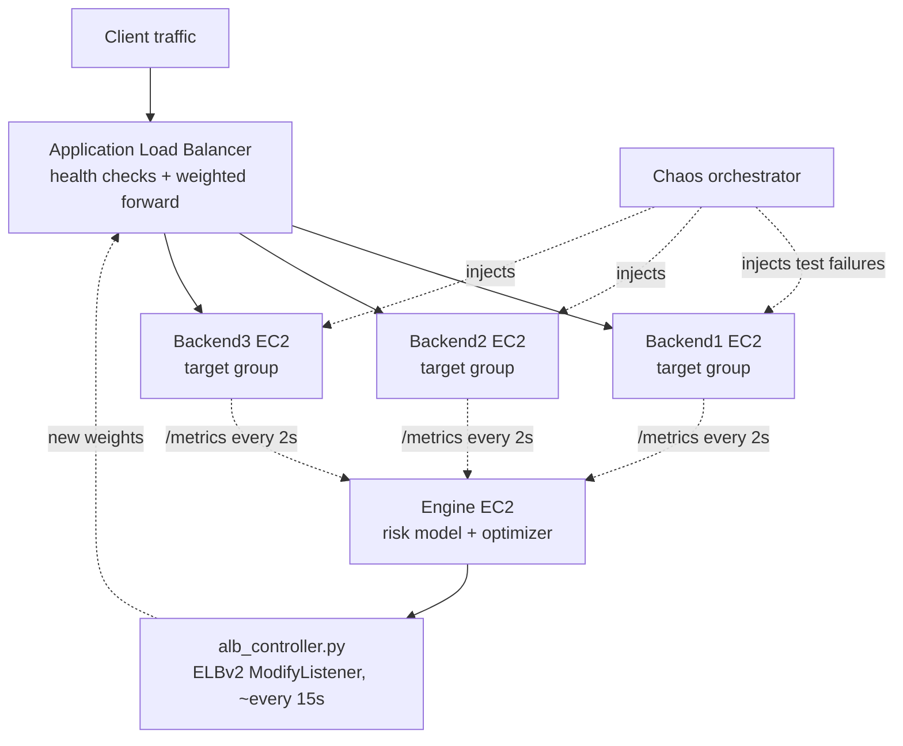

# ML-Assisted Traffic Optimization Layer for AWS ALB

A control-plane layer that sits on top of a **real AWS Application Load Balancer** and
dynamically reweights its target groups based on live backend failure-risk scoring and
per-backend cost — replacing static Round Robin / Least Outstanding Requests routing
with a risk- and cost-aware policy, without ever sitting in the actual request path.

## Why

ALB's built-in routing algorithms react to *load* — they have no visibility into a
backend's rising error rate, degrading latency, or the fact that one instance is more
expensive per request than another. This project adds that missing signal: an ML model
scores failure risk from live telemetry, an optimizer turns that into target-group
weights, and those weights get pushed into the ALB's real listener via the AWS API.

## Architecture

ALB stays the **data plane** — every client request goes through it, and it keeps doing
what it's actually good at (health checks, TLS termination, connection draining). The
engine is a separate **control plane** — it never touches a request. It polls backend
telemetry, scores risk, and periodically calls `ModifyListener` to update the ALB's
weighted forward action.



**Why two planes instead of one:** if the engine goes down, ALB keeps serving traffic
fine — it just stops receiving new weight updates and freezes at the last split it was
given. Routing degrades gracefully to "static," not "broken."

## How it works

1. **Chaos injection** — each backend can be told to simulate latency spikes, error
   bursts, CPU pressure, or combinations, via a `/chaos/set` endpoint, randomly
   orchestrated across backends and severities.
2. **Risk scoring** — the engine polls each backend's telemetry every 2s and scores
   failure risk with a trained classifier (logistic regression → XGBoost).
3. **Optimization** — a constrained SciPy optimizer turns per-backend risk + relative
   cost into target traffic weights, balancing "avoid the risky backend" against
   "don't just dump everything on the cheapest one."
4. **Real ALB integration** — `alb_controller.py` pushes those weights into the ALB
   listener's weighted `forward` action via `boto3`, rate-limited to a periodic
   control-plane update (not per-request, since ELBv2 API calls have their own
   throttling limits and request-to-request risk signals don't meaningfully change).
5. **Active-learning retraining** — the model is retrained iteratively: iteration 1
   trains on baseline traffic, iteration 2 adds iteration 1's collected data, iteration
   3 adds iteration 2's — so the model sees traffic shaped by its own decisions, not
   just the static baselines.
6. **Benchmarking** — evaluated against ALB's own *native* Round Robin and Least
   Outstanding Requests algorithms (both real `load_balancing.algorithm.type` values on
   an ALB target group), under the same chaos-injection distribution, so the baselines
   aren't a strawman.

## Tech stack

AWS ALB · Boto3 (ELBv2 API) · FastAPI · XGBoost / Scikit-learn · SciPy (constrained
optimization) · Docker Compose · Locust (load generation) · Prometheus

## Results

Measured against real chaos-injected traffic on 3 EC2 backends behind a real ALB:

| Metric | Round Robin | LOR | Optimizer |
|---|---|---|---|
| Error rate | 0.0252 | 0.0193 | **0.0108** |
| Cost per request | 1.4959 | 1.5013 | **1.4483** |
| P95 latency (s) | 0.21 | 0.33 | 0.35 |
| Throughput (req/s) | 568.5 | 511.2 | 485.2 |

- **57% lower error rate** than Round Robin, **44% lower** than LOR — achieved by
  correctly shifting traffic away from a risk-flagged backend.
- **~3% lower cost per request** than both baselines, from preferring the cheaper
  healthy backend when risk is comparable.
- **Latency tradeoff, not yet tuned away**: P95/avg latency and throughput are worse
  than Round Robin in this run. The optimizer's objective function currently weights
  error-avoidance and cost more heavily than latency — a real tuning gap, not a claim
  this is production-ready as-is.

## Project structure

```
├── backends/              # Simulated backend services with injectable chaos
├── chaos/                 # Chaos orchestration service
├── engine/                # Risk model, optimizer, ALB control loop
│   ├── optimizer.py       # FastAPI app: telemetry polling + SciPy optimizer
│   ├── alb_controller.py  # Pushes weights to ALB via boto3 (ELBv2)
│   └── rl_agent.py        # RL-based risk calibration
├── router/                # Custom router (local/dev alternative to real ALB)
├── risk-model/            # Training, active-learning loop, benchmarking harness
│   ├── generate_and_train.py
│   ├── run_aws_benchmarks.py
│   ├── alb_baseline.py    # Switches ALB's native algorithm for baseline phases
│   └── compare_all.py
├── loadtest/              # Locust load generation
├── docker-compose*.yml    # Local dev vs. real-ALB (Option 2) deployment
└── AWS_DEPLOYMENT.md      # Full AWS setup: target groups, ALB, IAM, deployment
```

## Setup

See [`AWS_DEPLOYMENT.md`](./AWS_DEPLOYMENT.md) for full AWS deployment instructions,
including creating the target groups, the ALB and listener, and the IAM policy the
engine instance needs. For local development, `docker compose up --build` runs the
whole stack (router + backends + engine) on one machine.

## Known limitations / next steps

- Chaos injection uses the same *distribution* across benchmark phases but isn't a
  fixed, replayed schedule — a deterministic chaos seed would make baseline comparisons
  tighter.
- The optimizer's objective weighting needs tuning to recover the latency regression
  seen against Round Robin.
- SLA violation tracking isn't implemented against the real-ALB deployment (it
  required per-request logs the router used to keep; not yet replicated).
- The engine instance is a single point of failure for *adaptation* (not for serving —
  ALB keeps working if it's down, but stops receiving weight updates).
